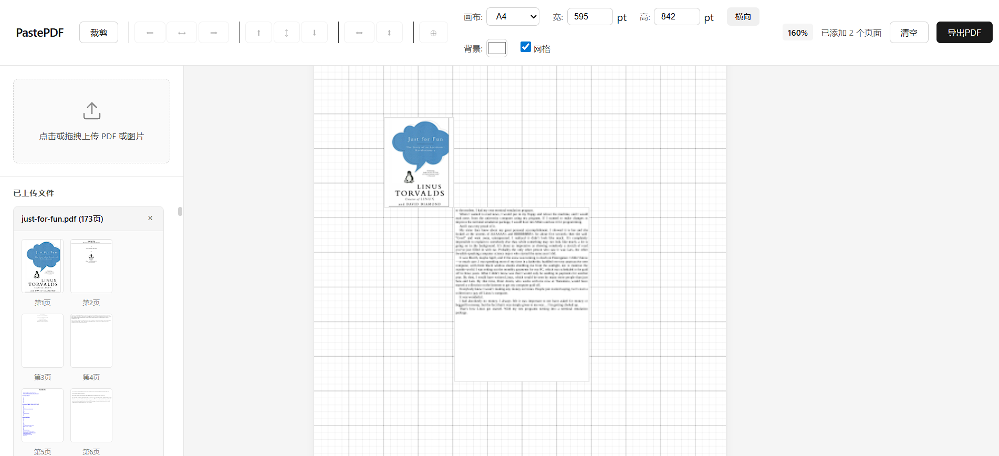
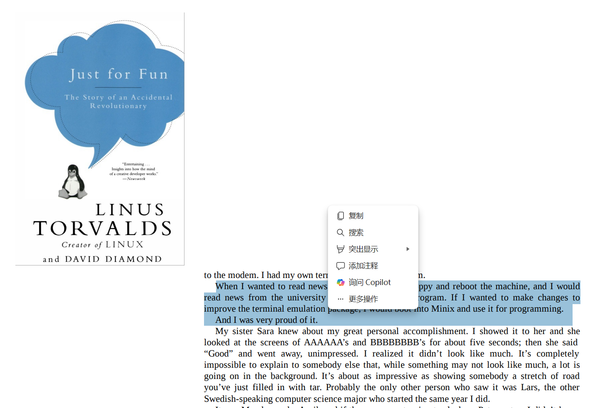

# PastePDF

A browser-based PDF page merging tool. Run locally and access via browser to visually arrange and merge multiple PDF pages into a single page using drag-and-drop.





## Features

- **Zero Installation**: Run `python app.py`, open `http://127.0.0.1:5000` in browser
- **Visual Drag & Drop**: Freely arrange PDF pages on canvas with real-time preview
- **Crop Support**: Crop selected pages to specific regions
- **Grid & Zoom**: Toggle grid overlay and zoom canvas with Ctrl+scroll

## Quick Start

```bash
# Install dependencies
pip install -r requirements.txt

# Start server
python app.py

# Open in browser
http://127.0.0.1:5000
```

## How It Works

### Two-Phase Approach: Preview vs Export

| Phase | Implementation | Purpose |
|-------|---------------|---------|
| **Preview** | PDF pages rendered to PNG images | Browser Canvas display only |
| **Export** | PyMuPDF native `show_pdf_page()` | Embeds PDF content as XObject, preserves vector/text |

**Why this design?**
- Browsers cannot directly render PDF to Canvas - must convert to images for preview
- Export uses `page.show_pdf_page()` to embed source PDF pages without rasterization
- Final PDF maintains selectable text, scalable vectors, and no quality loss

### Core Technology: `page.show_pdf_page()`

```python
import fitz

# Create new document
new_doc = fitz.open()
new_page = new_doc.new_page(width=595, height=842)

# Open source PDF
src_doc = fitz.open("source.pdf")

# Embed source PDF page into destination rectangle
dest_rect = fitz.Rect(0, 0, 297, 421)  # x0, y0, x1, y1
new_page.show_pdf_page(dest_rect, src_doc, 0)  # 0 = first page

# Supports rotation
new_page.show_pdf_page(dest_rect, src_doc, 0, rotate=90)

new_doc.save("output.pdf")
```

## Features Overview

### File Management
- Upload PDF/images via click or drag-and-drop
- Multiple file upload support
- Thumbnail preview for all pages
- Delete uploaded files

### Canvas Operations
- **Drag & Drop**: Position pages anywhere on canvas
- **Resize**: 8 control handles (4 corners + 4 edge midpoints)
- **Aspect Ratio**: Hold Shift while dragging to maintain proportions
- **Rotate**: 90° rotation via right-click menu or keyboard shortcut
- **Layer Control**: Adjust z-order of overlapping pages
- **Crop**: Select and crop specific regions of pages
- **Alignment Guides**: Visual guides when dragging
- **Grid Overlay**: Toggle grid for precise positioning
- **Zoom**: Ctrl+scroll to zoom canvas

### Canvas Settings
- **Preset Sizes**: A4, A3, Letter
- **Custom Dimensions**: Input custom width/height in points (1pt = 1/72 inch)
- **Orientation**: Toggle portrait/landscape
- **Background Color**: Set output PDF background color

### Export
- Generate merged PDF using PyMuPDF native operations
- Preserves vector quality and selectable text
- Automatic download to local machine

## Keyboard Shortcuts

| Shortcut | Action |
|----------|--------|
| Delete | Delete selected page |
| Ctrl+Z | Undo |
| Ctrl+Y | Redo |
| R | Rotate selected page 90° |
| Shift+Drag | Maintain aspect ratio while resizing |
| Ctrl+Scroll | Zoom canvas |

## API Endpoints

### Upload PDF
```
POST /api/upload
Content-Type: multipart/form-data

Response:
{
  "success": true,
  "file_id": "uuid-string",
  "filename": "example.pdf",
  "page_count": 5,
  "pages": [...]
}
```

### Get Thumbnail (Preview Only)
```
GET /api/thumbnail/<file_id>/<page_num>?scale=1.0

Response: PNG image for Canvas display
```

### Export Merged PDF (Native PyMuPDF)
```
POST /api/export
Content-Type: application/json

Request:
{
  "canvas_width": 595,
  "canvas_height": 842,
  "background_color": "#ffffff",
  "items": [
    {
      "file_id": "uuid-string",
      "page_num": 0,
      "x": 0,
      "y": 0,
      "width": 297.5,
      "height": 421,
      "rotation": 0
    }
  ]
}

Response: PDF file download
```

### Delete File
```
DELETE /api/file/<file_id>
```

### List Files
```
GET /api/files
```

## Project Structure

```
pastepdf/
├── app.py                 # Flask server
├── requirements.txt       # Python dependencies
├── README.md
├── CLAUDE.md              # Development guide
├── static/
│   ├── css/
│   │   └── style.css      # Styles
│   └── js/
│       └── main.js        # Canvas drag/resize logic
├── templates/
│   └── index.html         # Main page
└── uploads/               # Temporary upload directory (auto-created, cleaned on exit)
```

## Dependencies

```
flask>=2.0
pymupdf>=1.20
```

## Implementation Notes

### Backend (PyMuPDF)

```python
# Core export logic
def export_pdf(canvas_width, canvas_height, items):
    new_doc = fitz.open()
    new_page = new_doc.new_page(width=canvas_width, height=canvas_height)

    for item in items:
        src_doc = fitz.open(uploaded_files[item['file_id']])
        dest_rect = fitz.Rect(
            item['x'],
            item['y'],
            item['x'] + item['width'],
            item['y'] + item['height']
        )
        new_page.show_pdf_page(
            dest_rect,
            src_doc,
            item['page_num'],
            rotate=item.get('rotation', 0)
        )
        src_doc.close()

    return new_doc.tobytes()
```

### Frontend (Canvas)

- Native JavaScript for drag-and-drop and resize
- Canvas binds mousedown/mousemove/mouseup events
- Detects mouse position to determine move vs resize action
- Real-time Canvas redraw for preview
- Calls `/api/thumbnail` to load page images for Canvas display
- POST to `/api/export` with items array to generate final PDF

## License

MIT

## Contributing

Contributions welcome. Please ensure code follows the existing style and includes appropriate tests.
